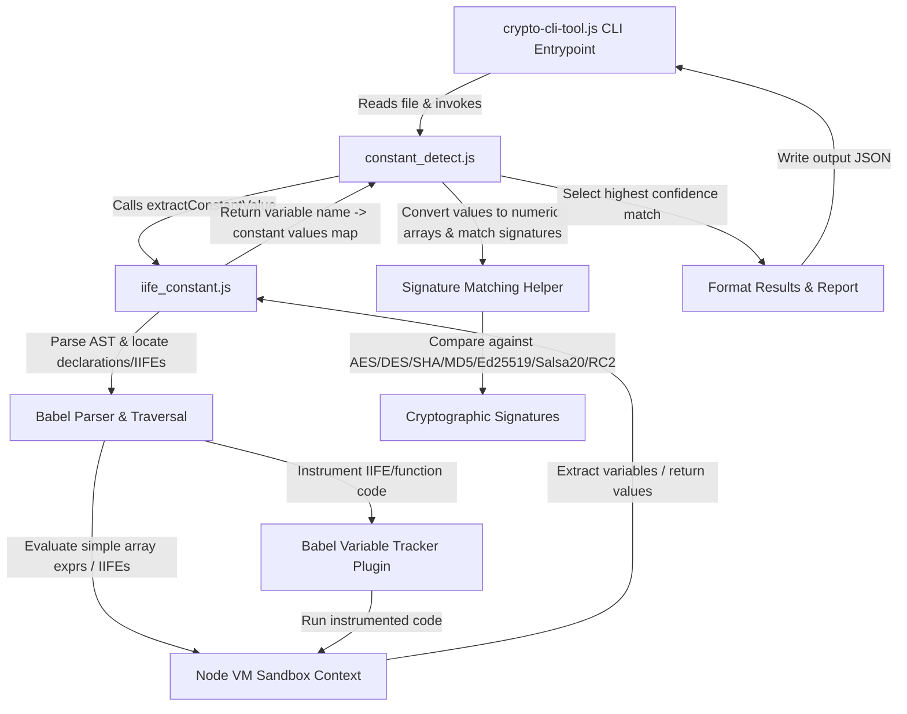

# jsmisuse

## Getting started

npm install

## Crawler

node generate_sites.js 1000

node crawler.js random-1000-sites.csv ./output 50 2 8

Crawl all generated random selected sites in 8 parallel jobs:

## test crypto detection

You can use the real case test

```bash
node crypto-cli-tool.js local_tests/real-tests/script_6e637aad.js
```

Should detect algorithms: AES, SHA-1, MD5, SHA-256

## Cryptographic Constant Detection Flow

`jsmisuse` implements a hybrid static-dynamic analysis pipeline to detect cryptographic algorithm constants in JavaScript code. The detection pipeline flows from the CLI entry point down to the dynamic interpreter sandbox:



### Detailed Pipeline Breakdown

1. **CLI Entrypoint ([crypto-cli-tool.js](crypto-cli-tool.js))**
   - Serves as the command-line interface to trigger analysis on a specific JavaScript file.
   - Reads target file content and calls the core detection function [detectCryptoConstants](src/checker/constant_detect.js#L268).
   - Formats the resulting detection data, displays a summary to the console, and writes the output JSON file.

2. **AST Extraction & Dynamic Evaluation ([iife_constant.js](src/pre/iife_constant.js))**
   Because obfuscated or bundled JS code often initializes arrays dynamically (e.g., inside Immediately Invoked Function Expressions (IIFEs) or self-executing routines), static parsing alone is insufficient. This module uses a hybrid approach:
   - **AST Parsing**: Parses target JavaScript code into an AST using `@babel/parser` to locate variable declarations, assignments, object properties, and IIFEs.
   - **Dependency Resolution**: For IIFEs/functions, it traces outer-scope variable dependencies and evaluates their declarations first to rebuild context.
   - **Code Instrumentation**: Instruments IIFEs/functions using `@babel/core` and a custom Babel plugin [createVariableTrackerPlugin](src/pre/iife_constant.js#L39). The plugin inserts tracing code (`globalThis.__trace.<var> = <var>`) after declarations or assignments, allowing extraction of intermediate values.
   - **Dynamic Evaluation (VM Sandbox)**: Runs the array expressions, IIFEs, or parameterless functions inside a safe Node.js `vm` sandbox context (`vm.runInContext`) with standard built-in globals. It captures array values, returned values, and tracked internal variables.
   - **Recursive Flattening**: Recursively traverses extracted objects to gather nested array constants.
   - Returns a mapping of variables to evaluated values via [extractConstantValue](src/pre/iife_constant.js#L178).

3. **Cryptographic Constant Checking ([constant_detect.js](src/checker/constant_detect.js))**
   - Normalizes all extracted constant values into numeric arrays (handling hexadecimal/decimal string elements and multi-dimensional structures).
   - Checks the numeric arrays against predefined cryptographic signatures (`CRYPTO_SIGNATURES`):
     - **AES**: S-box, Inverse S-box, round constants (Rcon), MixColumns matrix.
     - **DES**: PC2 permutation table, S-box signatures, permutation table values.
     - **SHA (SHA-1, SHA-256, SHA-512)**: Initial hash values and round constants.
     - **MD5**: Initial hash values and round constants.
     - **Ed25519**: Modular arithmetic field prime, curve parameter $d$, base point coordinates, etc.
     - **Salsa20**: Sigma/Tau key expansion constants (as string and 32-bit values).
     - **RC2**: PiTable constants.
   - Compares arrays using signature matching helpers:
     - `containsSequence()`: Identifies consecutive matching subsequences (e.g. S-boxes, permutation tables).
     - `containsValues()`: Calculates percentage matches of signature values, supporting both signed and unsigned 32-bit representations.
   - Selects the matching algorithm with the highest confidence score and collects position details.

## Crypto usage analyze

Put your openrouter API key in `src/agent/open_router.py` file, then run the following command to analyze all crawled domains:

To run the cryptographic agent analysis on all crawled domains in parallel (e.g., with 4 parallel jobs):

```bash
python batch_agent_analysis.py --concurrency 4 --model anthropic/claude-opus-4.8-fast --max-turns 25


Notes:
* By default, omitting `--count` will automatically select and analyze **all** available crawled domains (in sorted alphabetical order). If you want to analyze a subset, you can specify `--count <N>`.
* `--concurrency 4` enables running 4 analysis jobs in parallel.
* The script will update a console progress bar in real-time and print buffered execution results as each job completes.
